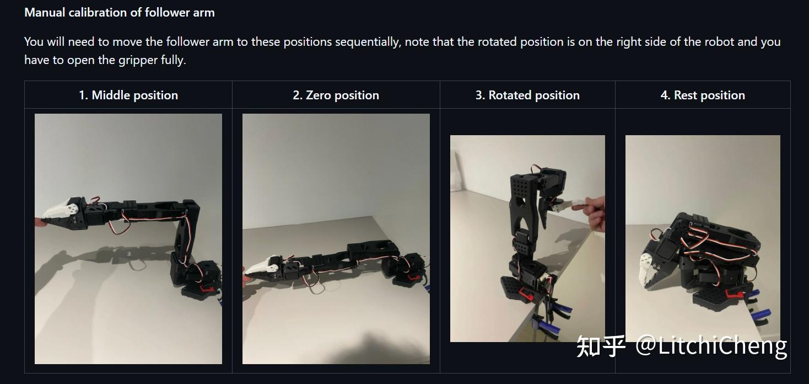
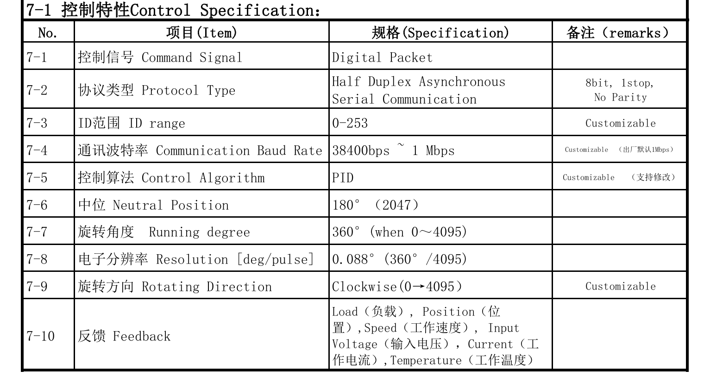

# SO-ARM100
Some Test code on SO-ARM100

## FeetechMotor.py

1. `pip3 install feetech-servo-sdk`

## Calibration Position

## Feetech Info

[spec](https://www.feetech.cn/525603.html)

[proto](http://doc.feetech.cn/#/prodinfodownload?srcType=FT-SCSCL-emanual-cbcc8ab2e3384282a01d4bf3)

